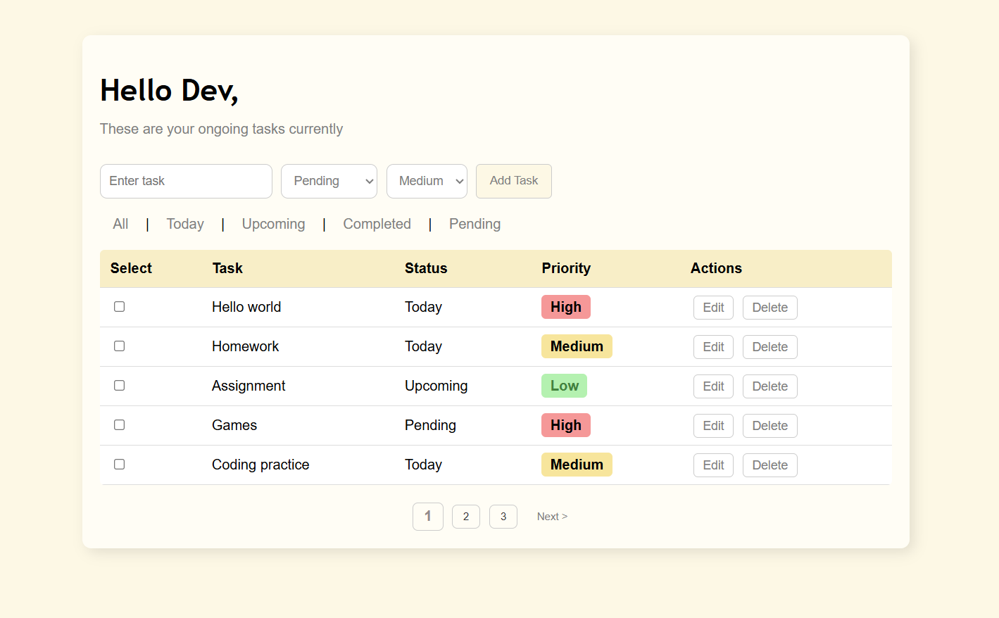
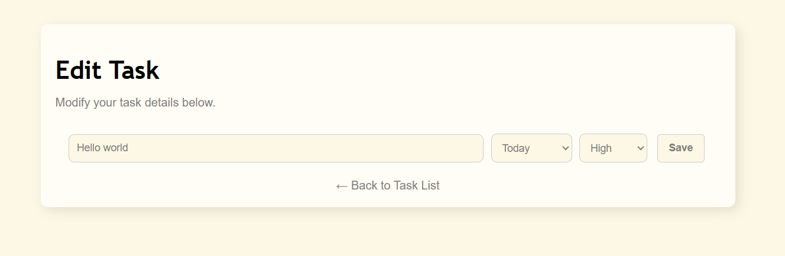

# **📝 To-Do App**
A simple task management web application that allows users to add, update, and track their daily tasks.

## **📌 Features**
- Add tasks with status and priority.  
- Update task status (Pending, Today, Upcoming, Completed).  
- Edit or delete tasks.  
- Filter tasks by status.  
- Pagination that only appears when needed.  
- User-Friendly UI – Designed with a simple and intuitive interface.

---

## **📌 Tech Stack**
- **Backend**: Flask (Python)
- **Frontend**: HTML, CSS, JavaScript
- **Database**: SQLite

## 🔧 Requirements  
Before running the project, ensure you have the following installed:  
- Python 3.x
- Flask Framework
- Flask-SQLAlchemy

To install all dependencies, run:
  ```sh
  pip install -r requirements.txt
  ```  
---

## **Installation and Usage**
### **1. Clone or Download the Project**
```sh
git clone https://github.com/Dibyaranjan27/python-programming-projects.git
cd flask-todo-app
```

### **2. Install Dependencies**
```sh
pip install -r requirements.txt
```
### **3. Run the Application**
```sh
python app.py
```
The application will run at http://127.0.0.1:5000/.
---

## 🚀 Usage
1. Open the web app in your browser.
2. Use the form to add new tasks.
3. Update the task status using the checkbox.
4. Edit or delete tasks as needed.
5. Filter tasks based on their status.

---

## 🖥️ Example Output



---

## 📂 File Structure

```
/flask-todo-app  
│── static/                   # CSS and static files
│   ├── styles.css            # CSS file   
│── templates/                # HTML templates  
│   ├── index.html            # Main page  
│   ├── edit.html             # Edit task page  
│── app.py                    # Flask app logic  
│── requirements.txt          # Required dependencies  
│── README.md                 # Documentation  
```

## 🤝 Contribution
Feel free to contribute! Fork the repository, make improvements, and submit a pull request. 😊

## 📜 License
This project is open-source and available under the MIT License.

## 💡 Author
Dibyaranjan Maharana  
[GitHub](https://github.com/Dibyaranjan27)  | [LinkedIn](https://www.linkedin.com/in/dibyaranjan-maharana-1228012b2/) 
